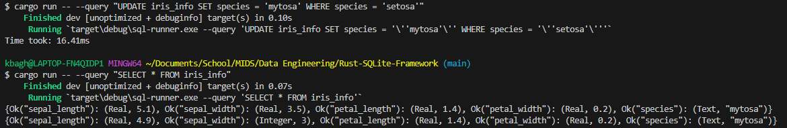
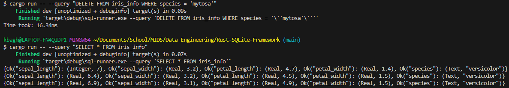

[](https://github.com/nogibjj/kb545-rust-python-compare/actions/workflows/release.yml)
[](https://github.com/nogibjj/kb545-rust-python-compare/actions/workflows/lint.yml)
[](https://github.com/nogibjj/kb545-rust-python-compare/actions/workflows/rustfmt.yml)
[](https://github.com/nogibjj/kb545-rust-python-compare/actions/workflows/tests.yml)

# Rust SQLite CLI with Binary

The goal of this project was to create a Rust repository that is able to create an SQLite databse, populate it with any csv document (I elected to work with the standard ```iris.csv``` dataset), and execute any user inputted query. This project is a CLI to maximize ease of use for a user, and allow them to query whatever they want. There is constant error handling and logging implemented for any situation that may arise, and the entire project is wrapped in a Rust Binary file. This project was created while adhering to DevOps principles, and is fully tested, linted, formatted, and built. A deeper explanation of the project, and how to run it, is explained below.

### Project Explanation
The goal of this project was to create a Rust CLI with SQLite. The Rust CLI was used with ```clap```, to get the user command-line input. The input will be a valid SQL query. Once recieved, the code will utilize ```rusqlite``` and create a SQLite database object. Then, this database will have a table created, with the values populated from a csv documnet. Utilizing the ```csv``` crate, the dataset will be fully read in and used to fully populate the table. At this stage, the script will then execute the user inputted query, and print back on the command line the result. There is logging to detect if populating the data, and if the SQL query, output an error. This is done by working alongside ```std::error```. The full list of dependencies used, and their respective versions is found in the file ```Cargo.toml```

There is testing implemented to determine if the database was properly created, as well as a SQL query execution is valid or not. The code is also properly linted (with Clippy) and formatted.

* To test the code, run ```make test```
* To lint the code, run ```make lint```
* To format the code, run ```make format```
* To run the code, run ```cargo run -- --query "YOUR QUERY HERE"``` (This will install all of the required dependencies before executing)
* To create the Rust Binary file, run ```make release```

### GitHub Copilot
As Rust is a personal new language, and one with a lot of moving parts, I used GitHub Copilot to help fill the gaps in knowledge. More specifically, I used GitHub Copilot to explain the (numerous) errors I faced in a simpler manner, so that I could then properly debug them. This sped up the debugging process but a considerable amount, and helped reveal how optimized the Rust language can become. As well, I used Copilot to explain the different parts of functions that ```rusqlite``` required I used for query execution, as there wasn't a great explanation in the crate's documentation. Copilot is slightly limited in its Rust expertise however, so I only limited Copilot use for explaining, and elected to look at Rust documentation to fix any code issues that I faced.

### CRUD Opeartions
The following below are screenshots that demonstrates that the code supports C.R.U.D operations (Create, Read, Update, Delete). All of them are SQL queries that were successfully executed.

* **Create**


* **Read**


* **Update**



* **Delete**




